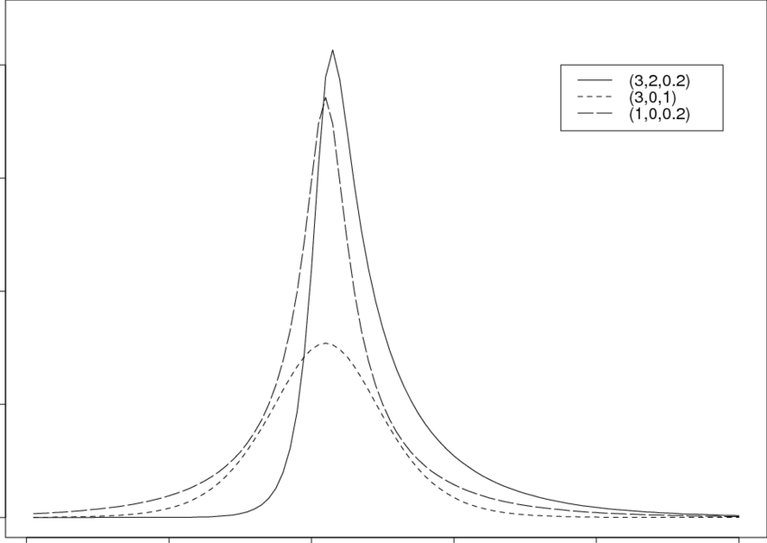

# Part 1

## Fit CAPM

I calculated return and volatility contribution of the portfolios. First, I fitted CAPM for the data up to the end of 2023 and got the following result:

|     | Symbol | Alpha         | Beta     | ResidualStd |
|-----|--------|---------------|----------|-------------|
| 0   | WFC    | -2.786976e-04 | 1.144627 | 0.014701    |
| 1   | ETN    | 7.318968e-04  | 1.117638 | 0.013899    |
| 2   | AMZN   | 9.409601e-04  | 1.534187 | 0.016383    |
| 3   | QCOM   | -4.403113e-07 | 1.475888 | 0.015558    |
| 4   | LMT    | -5.413857e-04 | 0.321020 | 0.010969    |
| ... | ...    | ...           | ...      | ...         |
| 94  | MSFT   | 7.695527e-04  | 1.166812 | 0.012441    |
| 95  | PEP    | -5.877193e-04 | 0.376862 | 0.008975    |
| 96  | CB     | -3.810986e-04 | 0.458951 | 0.012284    |
| 97  | PANW   | 1.953089e-03  | 1.175995 | 0.021732    |
| 98  | BLK    | -4.919844e-04 | 1.241606 | 0.009375    |

## Discussion

I calculated daily returns and weights through time, and used Cariño’s K to scale them. Risk attribution is calculated using OLS. To account for the risk free rate in the contribution, I put it in the idiosyncratic bucket. Thus, the return and volatility attributed to $r_f$ are included in Alpha.

The attribution for each portfolio and total portfolio are followd.

### Total

|                    | SPY      | Alpha     | Portfoliio |
|--------------------|----------|-----------|------------|
| Total Return       | 0.198692 | 0.021141  | 0.204731   |
| Return Attribution | 0.181629 | 0.023102  | 0.204731   |
| Vol Attribution    | 0.007203 | -0.000113 | 0.007090   |

### A

|                    | SPY      | Alpha     | Portfoliio |
|--------------------|----------|-----------|------------|
| Total Return       | 0.198692 | -0.040118 | 0.136642   |
| Return Attribution | 0.180666 | -0.044024 | 0.136642   |
| Vol Attribution    | 0.007062 | 0.000356  | 0.007418   |

### B

|                    | SPY      | Alpha    | Portfoliio |
|--------------------|----------|----------|------------|
| Total Return       | 0.198692 | 0.026941 | 0.203526   |
| Return Attribution | 0.174776 | 0.028750 | 0.203526   |
| Vol Attribution    | 0.006400 | 0.000468 | 0.006867   |

### C

|                    | SPY      | Alpha    | Portfoliio |
|--------------------|----------|----------|------------|
| Total Return       | 0.198692 | 0.084743 | 0.281172   |
| Return Attribution | 0.189702 | 0.091471 | 0.281172   |
| Vol Attribution    | 0.007224 | 0.000700 | 0.007924   |

Here we noticed that Portfolio C has the higest return while Portfolio A has the lowest. 
Alpha of the total portfolio, portfolio A and B are negative (if we subtract $r_f$ from alpha). These portfolios perform not as well as the market. Portfolio C has a slightly positive alpha.
Attributions explain the fact that SPY is attributed to the majority of the return and volatility, while alpha accounts for the minority.

# Part 2

## Optimize portfolio

Sharpe Ratio divides a portfolio's excess returns by a measure of its volatility to assess risk-adjusted performance. We optimized the portfolios using Sharpe Ratio as the metric. Our target is to maximize the Sharpe Ratio of each portfolio.

## Result

The optimized weights and lowest Sharpe ratio of portfolios are followed.

### Total

```
Optimized Weights: [8.98549066e-03 1.59464503e-02 4.13643419e-02 2.14358093e-03
 0.00000000e+00 0.00000000e+00 0.00000000e+00 4.53055928e-02
 4.96022494e-18 0.00000000e+00 0.00000000e+00 8.24407299e-02
 1.34955161e-02 0.00000000e+00 4.01154804e-18 2.19550940e-18
 3.76659165e-02 0.00000000e+00 7.22162493e-03 1.66696084e-18
 3.26253127e-02 0.00000000e+00 6.59170748e-02 3.76082629e-19
 1.05709712e-18 0.00000000e+00 0.00000000e+00 2.44961245e-02
 6.77626358e-19 0.00000000e+00 2.37169225e-18 8.04559656e-03
 8.05020113e-18 2.50721752e-18 3.07148191e-02 4.93429178e-02
 1.94572129e-02 2.68340038e-18 0.00000000e+00 9.48676901e-20
 0.00000000e+00 0.00000000e+00 2.81892565e-18 7.95034493e-02
 0.00000000e+00 2.47471712e-02 1.23099507e-02 0.00000000e+00
 5.96311195e-19 4.17417836e-18 0.00000000e+00 0.00000000e+00
 0.00000000e+00 0.00000000e+00 5.93052717e-02 0.00000000e+00
 8.90343497e-02 0.00000000e+00 1.04354459e-18 0.00000000e+00
 1.93801138e-18 0.00000000e+00 5.27748483e-04 9.77659362e-03
 0.00000000e+00 0.00000000e+00 1.42301535e-18 0.00000000e+00
 9.75781955e-19 3.53040907e-02 5.01250307e-03 3.46944695e-18
 4.77048956e-18 3.75405002e-18 0.00000000e+00 0.00000000e+00
 2.23845231e-03 1.59002741e-02 0.00000000e+00 1.21972744e-18
 1.79773085e-02 0.00000000e+00 0.00000000e+00 1.20617492e-18
 2.92734587e-18 0.00000000e+00 0.00000000e+00 2.51635824e-02
 3.57880482e-02 5.07219669e-02 0.00000000e+00 0.00000000e+00
 8.94466792e-19 3.40094740e-02 1.75114625e-02 2.98155597e-19
 2.10064171e-18 1.45012041e-18 0.00000000e+00]

Lowest Sharpe Ratio: 0.0716
```

|                    | SPY      | Alpha     | Portfoliio |
|--------------------|----------|-----------|------------|
| Total Return       | 0.198692 | 0.057423  | 0.349998   |
| Return Attribution | 0.284538 | 0.065460  | 0.349998   |
| Vol Attribution    | 0.011005 | -0.000233 | 0.010772   |


### A

```
Optimized Weights: [4.12813601e-04 5.53953448e-02 1.29397622e-01 3.62286898e-02
 0.00000000e+00 0.00000000e+00 8.13151629e-19 1.01455750e-01
0.00000000e+00 0.00000000e+00 0.00000000e+00 9.34639859e-02
 2.99255775e-02 0.00000000e+00 0.00000000e+00 1.67419096e-02
 1.11292254e-01 1.78893358e-18 8.67361738e-19 0.00000000e+00
 4.27364800e-02 2.79693723e-02 1.07693516e-01 7.56540923e-02
 4.49232586e-03 0.00000000e+00 5.42101086e-19 8.06554481e-02
 1.24683250e-18 1.62630326e-19 2.71050543e-19 7.68520340e-02
 9.63278427e-03]

Lowest Sharpe Ratio: 0.0691
```

|                    | SPY      | Alpha    | Portfoliio |
|--------------------|----------|----------|------------|
| Total Return       | 0.198692 | 0.091511 | 0.387120   |
| Return Attribution | 0.285774 | 0.101346 | 0.387120   |
| Vol Attribution    | 0.010561 | 0.001240 | 0.011801   |

### B

```
Optimized Weights: [5.34522860e-02 6.26138268e-02 7.34397955e-02 3.63376324e-02
 3.53142264e-19 0.00000000e+00 5.54934731e-03 0.00000000e+00
 0.00000000e+00 3.34786251e-02 1.05112490e-01 5.42101086e-20
 4.64092602e-02 2.07659567e-02 7.05365222e-02 0.00000000e+00
 2.87313576e-18 4.14707331e-18 1.04631810e-01 1.51866688e-02
 0.00000000e+00 1.21945810e-01 0.00000000e+00 1.08710517e-01
 0.00000000e+00 0.00000000e+00 1.40946282e-18 3.36102673e-18
 5.69206141e-19 8.62188602e-02 3.26393427e-02 0.00000000e+00
 2.29712490e-02]

Lowest Sharpe Ratio: 0.0694
```

|                    | SPY      | Alpha     | Portfoliio |
|--------------------|----------|-----------|------------|
| Total Return       | 0.198692 | -0.011335 | 0.234916   |
| Return Attribution | 0.247748 | -0.012832 | 0.234916   |
| Vol Attribution    | 0.009559 | 0.000109  | 0.009668   |

### C

```
Optimized Weights: [2.18933032e-18 3.78032066e-02 2.47312347e-03 1.00384946e-01
 2.00403722e-02 5.17207663e-20 3.40603916e-18 0.00000000e+00
 4.36970861e-03 2.03605565e-02 1.55066027e-02 6.67991412e-02
 1.09860690e-01 0.00000000e+00 3.18271698e-02 0.00000000e+00
 5.75150772e-02 1.56054016e-18 6.98038039e-19 4.82905106e-02
 2.54096283e-02 3.98227572e-02 3.70767815e-02 1.18393776e-01
 9.87592420e-19 2.32107065e-02 0.00000000e+00 6.02615588e-02
 9.86586074e-02 3.95983997e-18 5.60865783e-03 0.00000000e+00
 7.63264214e-02]

Lowest Sharpe Ratio: 0.0696

```

|                    | SPY      | Alpha    | Portfoliio |
|--------------------|----------|----------|------------|
| Total Return       | 0.198692 | 0.186446 | 0.489339   |
| Return Attribution | 0.282333 | 0.207006 | 0.489339   |
| Vol Attribution    | 0.010079 | 0.001588 | 0.011667   |

## Discussion

After our optimization based on Sharpe Ratio, the excess return over risk improved for our portfolios. Compared to Part 1, we can notice a significant increase in Alpha (except portfolio B,and the fact that a great portion of return is now comming from Alpha, which means the optimized portfolios are now performing better than the market. Volatility for the portfolios increased, but compared to the increase in return it's still worths.

# Part 3

## Normal Inverse Gaussian Distribution

Normal inverse Gaussian distribution (NIG) is defined as the normal variance-mean mixture where the mixing density is the inverse Gaussian distribution. It is controlled by four factors, location $\mu$, tail heaviness $\alpha$, asymmetry parameter $\beta$ and scale parameter $\delta$.


*Densities of the Normal Inverse Gaussian distribution for different values of the parameters ($\alpha$, $\beta$, $\delta$).*

Normal Inverse Gaussian can be flexible for modeling the returns of assets and market. Since NIG has fat tails, it is suitable for calculating metrics like VaR and ES, and conducting stress testing when extreme events in the market are common. The result with NIG can be more reliable than normal distributon or t distribution. NIG also has a skewness parameter so it can model the skewness for asset return.

## Skew Normal Distribution

Skew normal distribution is an extension to normal distribution, introducing a shape parameter $\alpha$ to allow for skewness.


*Densities of the Skew normal distribution for different values of the parameters $\alpha$.*

The skew normal distribution looks similar to NIG. They both allow for skewness, and have heavy tails. However, the tail of skew normal distribution is less heavy than NIG, and it requires less computational resources. Skew normal distribution is useful for modeling returns with asymmetry distribution. It can also enhances regression for CAPM or other factor models, allowing for residuals with non-symmetric distribution.

Reference for this part

[Normal inverse Gaussian distribution - Wikipedia](https://en.wikipedia.org/wiki/Normal-inverse_Gaussian_distribution)

[Skew normal distribution - Wikipedia](https://en.wikipedia.org/wiki/Skew_normal_distribution)

# Part 4

## Discussion

To find the best model for stocks in the portfolio, I fitted the four models to each of the stock. I used AIC as the metric, selecting the model with the lowest AIC.

$AIC=2k-2ln(\hat{L})$

Here are some of the models selected. To see full results, run the code for Part 4 in the note book.

```
100
Stock: SPY
Best Fit Model: norm
Parameters: (5.573408758158416e-20,0.008223707296535633)

Stock: AAPL
Best Fit Model: t
Parameters: (7.322068819646841,-2.6480440454887786e-05,0.010679805191820078)

Stock: NVDA
Best Fit Model: t
Parameters: (5.113166225558643,-0.0014719520005609743,0.021811002972574683)

Stock: MSFT
Best Fit Model: t
Parameters: (8.060684873955456,-0.00020043763567572265,0.0136456192915969)

Stock: AMZN
Best Fit Model: t
Parameters: (5.979974468331601,-0.00018303852167479684,0.016878723671842573)

Stock: META
Best Fit Model: t
Parameters: (4.3766570850200175,-0.0014513669790365367,0.015730758048864348)

Stock: GOOGL
Best Fit Model: t
Parameters: (4.429084512834611,-9.566956981451372e-05,0.014162777821186821)

Stock: AVGO
Best Fit Model: norminvgauss
Parameters: (1.6679024847192716,0.6267838352576902,-0.009152710866598242,0.022570824900888714)

Stock: TSLA
Best Fit Model: t
Parameters: (6.62034942029744,-0.0003283009658499856,0.027762995955942824)

Stock: GOOG
Best Fit Model: t
Parameters: (4.591835000163648,-2.3940864512828046e-05,0.01444807851988079)

Stock: BRK-B
Best Fit Model: t
Parameters: (6.697864269672545,9.71565538581592e-05,0.007230165278985905)

Stock: JPM
Best Fit Model: t
Parameters: (3.4928451276629526,0.0005495717194920681,0.008819658472986124)

Stock: LLY
Best Fit Model: t
Parameters: (3.268255029328043,-0.00027081585676292936,0.011239553639790104)

Stock: V
Best Fit Model: t
Parameters: (9.682055071437048,-1.0112202298013008e-05,0.008739151504781972)

Stock: XOM
Best Fit Model: t
Parameters: (7.99442414634308,-0.0001493729214269487,0.013579468515807162)

Stock: UNH
Best Fit Model: t
Parameters: (3.3676731900641004,0.0001015320507138933,0.00866660057452237)

Stock: MA
Best Fit Model: t
Parameters: (6.4093267046738855,0.00015048508595146449,0.008871237725415624)

Stock: COST
Best Fit Model: t
Parameters: (4.68623409806462,-6.28466058222004e-05,0.00903915178631263)

Stock: PG
Best Fit Model: t
Parameters: (5.5095857588534045,4.5899606363131434e-05,0.007575245993058994)

Stock: WMT
Best Fit Model: t
Parameters: (5.895915539161704,0.000520739977903083,0.007400220340019236)

Stock: HD
Best Fit Model: t
Parameters: (4.515643508753745,0.00020443978647826272,0.01019683460641882)

Stock: NFLX
Best Fit Model: t
Parameters: (3.750072473379367,-0.0011191866033690569,0.015722668318513072)

Stock: JNJ
Best Fit Model: t
Parameters: (3.588201927053618,0.0003912031043663077,0.007002771722056062)

Stock: ABBV
Best Fit Model: t
Parameters: (3.973147515386544,0.00039643263712557723,0.008630051142519742)

Stock: CRM
Best Fit Model: t
Parameters: (5.289218836782549,-0.0007173820506186495,0.014165171528839107)

Stock: BAC
Best Fit Model: t
Parameters: (4.30737680740498,-0.00027518410497611443,0.012746375057843097)

Stock: ORCL
Best Fit Model: t
Parameters: (3.0293041222262262,0.0011385503802875787,0.010761855997902199)

Stock: MRK
Best Fit Model: t
Parameters: (7.997877769857224,0.00017657955121200703,0.010317735200619441)

Stock: CVX
Best Fit Model: t
Parameters: (4.50138392149525,0.0003591701776042923,0.010985503206987678)

Stock: KO
Best Fit Model: t
Parameters: (5.174903331048792,0.0001914617562681079,0.006563607011046952)

Stock: CSCO
Best Fit Model: t
Parameters: (3.8334896309928546,0.000802148398990597,0.008443506948228187)

Stock: WFC
Best Fit Model: t
Parameters: (4.94967681187848,0.0001710741454718429,0.013652181494504086)

Stock: ACN
Best Fit Model: t
Parameters: (7.039748899750389,9.262201705036096e-05,0.011521755825206478)

Stock: NOW
Best Fit Model: norminvgauss
Parameters: (0.9617571392119513,-0.25324411571237726,0.005150561681599695,0.018870874481196856)

Stock: MCD
Best Fit Model: t
Parameters: (9.807122868362576,0.0001369671478206958,0.007865331188845788)

Stock: PEP
Best Fit Model: t
Parameters: (5.711143408967434,0.0002261163390272537,0.007591920403404389)

Stock: IBM
Best Fit Model: t
Parameters: (4.7897619033756484,0.00023152153810240852,0.00757794548483727)

Stock: DIS
Best Fit Model: t
Parameters: (4.890178542402129,0.00012326986027160898,0.01280430789761529)

Stock: TMO
Best Fit Model: t
Parameters: (5.133960389682095,3.842583331985242e-05,0.011368677512223452)

Stock: LIN
Best Fit Model: t
Parameters: (3.162666282384695,0.0002721906519609344,0.008282537493819832)

Stock: ABT
Best Fit Model: t
Parameters: (6.327766707162487,-0.00018841410579010088,0.009970739575269633)

Stock: AMD
Best Fit Model: t
Parameters: (4.852653444864645,-0.0007998631611319191,0.022696917557660845)

Stock: ADBE
Best Fit Model: t
Parameters: (5.737673346832365,0.00021294006438565144,0.016252543250118618)

Stock: PM
Best Fit Model: t
Parameters: (7.970361890033297,0.00012740941701507475,0.008982727134538342)

Stock: ISRG
Best Fit Model: t
Parameters: (4.661771681325623,0.0005588042209201823,0.013718603006916033)

Stock: GE
Best Fit Model: norminvgauss
Parameters: (6.146242692058914,2.099532933817385,-0.012341925908429977,0.033956819917058484)

Stock: GS
Best Fit Model: t
Parameters: (5.436306691729003,0.00028300916445153266,0.012173143434546257)

Stock: INTU
Best Fit Model: t
Parameters: (5.393754901585303,6.62166615934275e-05,0.014730587631130077)

Stock: CAT
Best Fit Model: t
Parameters: (4.470137616818184,-5.131023067992416e-05,0.013204472752112912)

Stock: QCOM
Best Fit Model: t
Parameters: (5.213785967589058,4.2085768927634565e-06,0.015586746163615404)

Stock: TXN
Best Fit Model: t
Parameters: (9.260908516407497,-0.00013382397338702065,0.013368168753794814)

Stock: VZ
Best Fit Model: t
Parameters: (3.2755613977407148,0.0003091711316979061,0.00911264880360259)

Stock: AXP
Best Fit Model: t
Parameters: (4.726666066063575,0.00018166830992971265,0.012300283525241026)

Stock: T
Best Fit Model: t
Parameters: (3.017391467340702,0.00024231122707919767,0.010037297455404392)

Stock: BKNG
Best Fit Model: t
Parameters: (8.464239554718397,-0.0002057503649760898,0.013562371494266603)

Stock: SPGI
Best Fit Model: t
Parameters: (4.120828534179271,0.0005861677003388016,0.009896562437417732)

Stock: MS
Best Fit Model: t
Parameters: (4.531248187095923,-0.00013067011819567432,0.0122908414345618)

Stock: RTX
Best Fit Model: t
Parameters: (3.19535711940388,0.00026564028231257613,0.00909103526182527)

Stock: PLTR
Best Fit Model: norminvgauss
Parameters: (0.6263949890899624,0.13031816427289408,-0.006922958856361953,0.032549451813925795)

Stock: PFE
Best Fit Model: t
Parameters: (4.067123219620353,0.00019683991170281017,0.010580011088371089)

Stock: BLK
Best Fit Model: t
Parameters: (8.300826784666494,-0.0001637663179043252,0.012093964658596518)

Stock: DHR
Best Fit Model: t
Parameters: (5.2247941386641035,0.00042945558551418144,0.011901429733867177)

Stock: NEE
Best Fit Model: t
Parameters: (2.9291111236303826,0.0004126669143923263,0.010660130253320296)

Stock: HON
Best Fit Model: t
Parameters: (5.656712076819863,0.0003640335778185255,0.00928610864948211)

Stock: CMCSA
Best Fit Model: t
Parameters: (4.574496024836469,-3.651871525836071e-05,0.010623253948216664)

Stock: PGR
Best Fit Model: t
Parameters: (2.63937230691327,0.00042447968013355566,0.009921525359652718)

Stock: LOW
Best Fit Model: norminvgauss
Parameters: (0.8942820080509905,0.08965713472741883,-0.001421522809648345,0.014106906614555968)

Stock: AMGN
Best Fit Model: norminvgauss
Parameters: (1.7084413430393306,0.4073490441357659,-0.004030530596730286,0.016416712475764136)

Stock: UNP
Best Fit Model: t
Parameters: (4.057654265302692,-0.00047890098391196485,0.009968796176007223)

Stock: TJX
Best Fit Model: t
Parameters: (10.172947044619963,2.9913284299586724e-05,0.009013316113465331)

Stock: AMAT
Best Fit Model: skewnorm
Parameters: (1.2451027993813149,-0.01680248151066402,0.02705265987185417)

Stock: UBER
Best Fit Model: t
Parameters: (9.936498259884736,-0.00014572785443134627,0.020119908214985195)

Stock: C
Best Fit Model: t
Parameters: (4.15354444951153,7.358422567482566e-05,0.011829613710104499)

Stock: BSX
Best Fit Model: t
Parameters: (3.5402719956028386,0.00012389405387536577,0.00864466853839745)

Stock: ETN
Best Fit Model: norminvgauss
Parameters: (0.8564573286448249,-0.11762190092245528,0.0021171750910858,0.015271318898846913)

Stock: COP
Best Fit Model: t
Parameters: (5.92484601220523,-9.838635449200831e-05,0.014525067995914537)

Stock: BA
Best Fit Model: t
Parameters: (4.696497251437103,0.00014510714569639793,0.013077453079615055)

Stock: BX
Best Fit Model: t
Parameters: (6.185408768585039,0.00038745815507962484,0.0181223573074138)

Stock: SYK
Best Fit Model: norminvgauss
Parameters: (0.3884053377695074,-0.028012375528157496,0.0006628174325080467,0.009166728436989348)

Stock: PANW
Best Fit Model: t
Parameters: (3.338200229390102,0.000209221760927367,0.015535659630277754)

Stock: ADP
Best Fit Model: t
Parameters: (3.350782505586524,0.0005615655145332333,0.008489863756751849)

Stock: FI
Best Fit Model: t
Parameters: (3.7459939505375965,-0.00016233877618883824,0.008860972239508035)

Stock: ANET
Best Fit Model: t
Parameters: (2.7606710295759918,-0.0002876014124539813,0.01556000207715888)

Stock: GILD
Best Fit Model: t
Parameters: (8.497315619406226,7.229181391093462e-05,0.01119708386306325)

Stock: BMY
Best Fit Model: t
Parameters: (4.2963778338413325,0.0002653745682617987,0.009044538445623846)

Stock: SCHW
Best Fit Model: t
Parameters: (2.8174799970702544,0.000443170575577055,0.015822480143763428)

Stock: TMUS
Best Fit Model: norminvgauss
Parameters: (1.7004057636930945,-0.4140187946754876,0.0037091739399908383,0.014775089254485708)

Stock: DE
Best Fit Model: t
Parameters: (5.5064547856333945,0.000491508479294971,0.013667293584615242)

Stock: ADI
Best Fit Model: t
Parameters: (6.33152569992148,3.391212758920164e-06,0.01351503513882642)

Stock: VRTX
Best Fit Model: t
Parameters: (4.032825774331921,-5.1041404105433315e-05,0.010421751913784555)

Stock: SBUX
Best Fit Model: t
Parameters: (4.183818603262333,9.23056283730856e-05,0.009612049200576372)

Stock: MMC
Best Fit Model: norminvgauss
Parameters: (1.5266859854392796,-0.4046686427177798,0.003383513336259275,0.012308429331327267)

Stock: MDT
Best Fit Model: t
Parameters: (4.563357789080366,0.0001034631487260463,0.010360811641383626)

Stock: CB
Best Fit Model: t
Parameters: (5.63726257391074,0.0001717307067552405,0.010308272369863952)

Stock: LMT
Best Fit Model: t
Parameters: (3.709443722508598,-6.262211495039424e-05,0.0073958989352957485)

Stock: KKR
Best Fit Model: t
Parameters: (7.201866366024914,0.00012034446611435885,0.016972830087589846)

Stock: MU
Best Fit Model: norminvgauss
Parameters: (1.4936972231105368,0.5126876418137961,-0.009292946857433461,0.025429843520540552)

Stock: PLD
Best Fit Model: t
Parameters: (6.823487309958756,4.7078171705644636e-05,0.013982652868010008)

Stock: LRCX
Best Fit Model: norminvgauss
Parameters: (1.6576134182728275,0.5028076696868728,-0.008719376322742358,0.027390702054033655)

Stock: EQIX
Best Fit Model: t
Parameters: (5.232300350432023,0.00027814773072486806,0.012177159261572205)
```

Most stocks are modeled with t distribution, and a few are modeled with NIG. This incicates the common existence of heavy tail in the returns.

I calculated the 1 day VaR and ES for each portfolio and the total portfolio using a Gaussian Copula and using a multivariate normal simulation. The results are followed.


# Part 5


*The optimizer in Python does not work well here, and the results may not be right.*